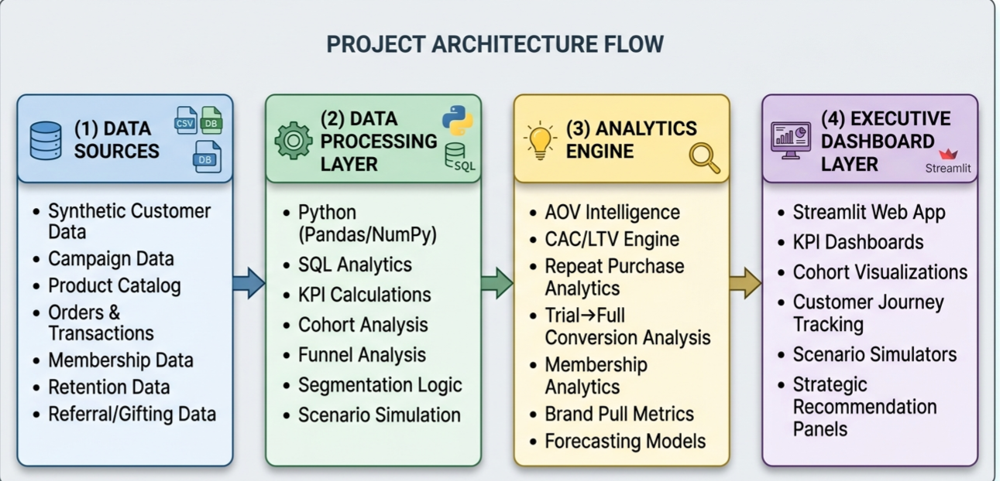

# 📈 Retention-Led D2C Growth Intelligence Platform

### Executive Analytics & Strategic Intelligence System for Premium D2C Brands

An end-to-end analytics and business intelligence platform designed to model, analyze, and optimize sustainable retention-led growth for premium D2C fragrance brands.

Inspired by the **Kross Kartel National Marketing Case Competition** and the growth challenges faced by **Bla Bli Blu**, this project transforms a strategic case competition solution into a fully operational intelligence ecosystem combining:

- Executive BI Dashboards
- Customer Lifecycle Analytics
- Cohort Retention Modeling
- Pricing & Profitability Simulation
- Strategic Scenario Forecasting
- AI-Powered Sentiment Analysis
- Consumer Intelligence Systems
- Business Intelligence & SQL Analytics

---

# 🚀 Live Dashboard

## Streamlit Deployment
[🔗 Launch Live Dashboard Here](https://blabliblu-growth-intelligence-platform.streamlit.app/)

---

# 🧠 Business Problem

The Indian premium fragrance market is rapidly growing, but D2C fragrance brands face increasing challenges around:

- Rising CAC (Customer Acquisition Cost)
- Offer & discount dependency
- Weak trial-to-full-size conversion
- Low repeat purchase rates
- Slowing LTV growth
- Heavy reliance on performance marketing

This platform was designed to model how retention-led premium growth strategies can improve:
- profitability
- customer loyalty
- premium positioning
- organic acquisition
- long-term scalability

---

# 🎯 Core Strategic Objectives

- Increase Average Order Value (AOV)
- Improve Trial → Full-Size Conversion
- Reduce Discount Dependency
- Improve D60/D90 Repeat Rates
- Strengthen Customer Lifetime Value (LTV)
- Simulate Premiumization Strategies
- Analyze Consumer Sentiment & Brand Perception
- Forecast Sustainable Revenue Growth

---

# 🏗️ Platform Architecture

## High-Level System Design



---

# 📊 Dashboard Ecosystem

## 1️⃣ Executive Intelligence Dashboard

Tracks:
- Revenue
- AOV
- LTV
- Repeat Purchase Rate
- Sentiment Score
- Customer Segment Performance

### Dashboard Preview


---

## 2️⃣ Retention & Cohort Analytics

Features:
- Cohort Retention Tracking
- Repeat Purchase Analysis
- Churn Risk Intelligence
- Segment-Level Lifecycle Analysis

### Dashboard Preview


---

## 3️⃣ Pricing & Margin Intelligence Simulator

Interactive simulation engine for:
- Discount reduction modeling
- Premiumization analysis
- AOV impact forecasting
- Margin optimization

### Dashboard Preview


---

## 4️⃣ Strategic Scenario Forecasting Engine

Models future business outcomes under:
- CAC inflation
- Organic growth
- Membership adoption
- Gifting expansion
- Retention improvement

### Dashboard Preview


---

## 5️⃣ Consumer & Market Intelligence Layer

AI-powered sentiment analysis system featuring:
- Emotional intelligence mapping
- Product perception analysis
- Review intelligence
- Word cloud analytics
- Pricing sensitivity signals

### Dashboard Preview


---

# 🧾 Data Architecture

## Synthetic Operational Data
Simulated:
- 50,000+ customers
- 150,000+ orders
- Customer cohorts
- Membership systems
- Referral behavior
- Discount dependency
- Lifecycle progression

## Real-World Market Signals
Integrated:
- Consumer review patterns
- Sentiment analysis
- Pricing perception
- Gifting behavior
- Brand emotion modeling

---

# 📈 Business Intelligence Features

- Customer Segmentation Engine
- Cohort Retention Analysis
- CAC Recovery Modeling
- Pricing Optimization
- LTV Forecasting
- Margin Intelligence
- Scenario Simulation
- NLP-Based Sentiment Analysis
- Executive KPI Monitoring
- Market Intelligence Analytics

---

# 🧠 Key Strategic Insights

- Premium loyalists generate disproportionately higher LTV and retention.
- Discount seekers compress margins and increase CAC recovery pressure.
- Gifting behavior creates strong organic acquisition loops.
- Membership systems significantly improve repeat purchase behavior.
- Premiumization strategies outperform aggressive discounting over time.
- Emotional brand perception strongly correlates with customer loyalty.

---

# 🛠️ Tech Stack

| Category | Technologies |
|---|---|
| Programming | Python |
| Analytics | Pandas, NumPy |
| Visualization | Plotly, Matplotlib |
| BI Dashboarding | Streamlit |
| Database | SQL, SQLite |
| NLP | TextBlob, WordCloud |
| Machine Learning | Scikit-learn |
| Version Control | Git, GitHub |

---

# 📂 Repository Structure

```bash
retention-led-d2c-growth-intelligence-platform/
│
├── data/
├── notebooks/
├── sql/
├── src/
├── dashboard/
├── reports/
├── docs/
└── pitch_deck/
```

---

# 🔬 Advanced Analytics Modules

- Executive KPI Intelligence
- Cohort Retention Analytics
- Customer Lifecycle Modeling
- Pricing & Margin Simulation
- Strategic Forecasting Engine
- Sentiment Intelligence Layer
- Consumer Behavior Analytics
- Market Intelligence Dashboard

---

# 📌 Strategic Differentiators

Unlike traditional dashboard projects, this platform combines:
- Business Strategy
- Analytics Engineering
- Executive BI
- Forecasting
- Consumer Intelligence
- Simulation Systems
- NLP & Sentiment Analysis

to create a realistic decision-support environment for retention-led D2C scaling.

---

# 🚀 Future Enhancements

- Real Reddit API Integration
- Live Shopify Analytics Integration
- ML-Based Churn Prediction
- Recommendation Engine
- Real-Time KPI Monitoring
- Advanced Forecasting Models
- AI-Based Consumer Persona Generation

---

# 🏆 Project Context

This project originated from the **Kross Kartel National Marketing Case Competition**, where our team was selected as a finalist for proposing a retention-led premium growth strategy for Bla Bli Blu.

The platform expands that strategic foundation into a fully operational analytics and intelligence ecosystem.

---

# 👨‍💻 Author

### Mujahid Kalanthar
